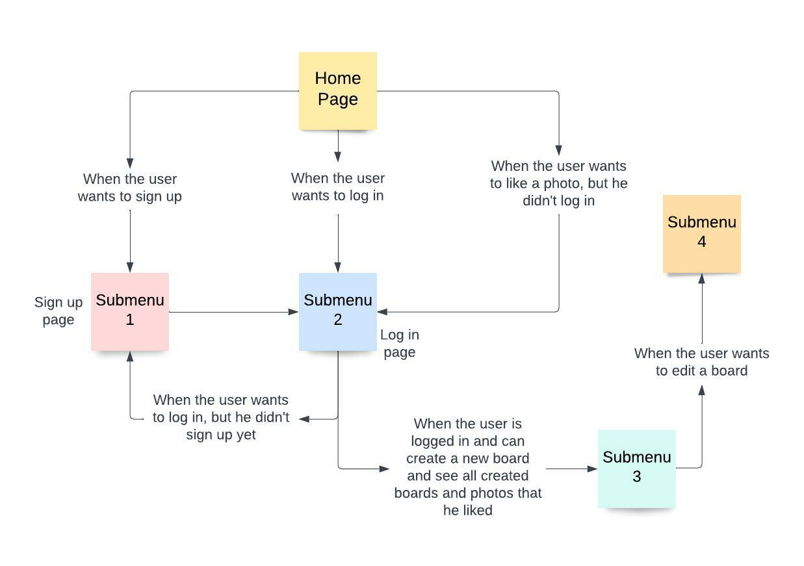
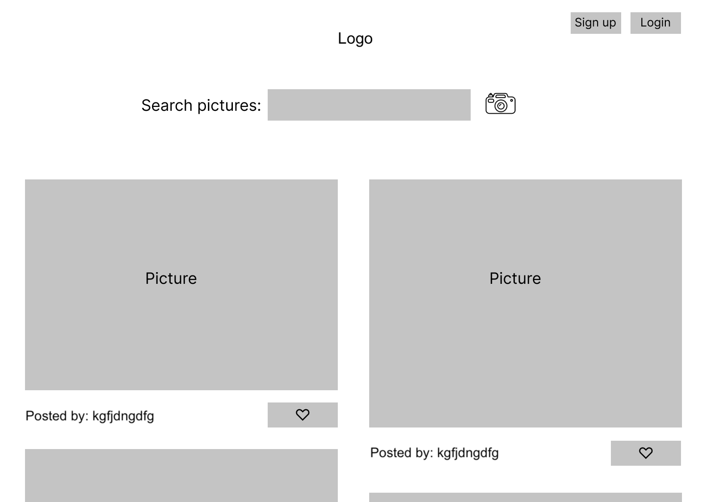
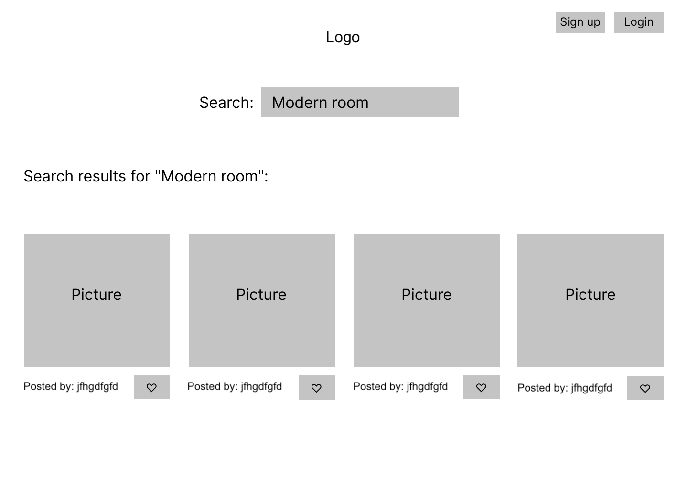
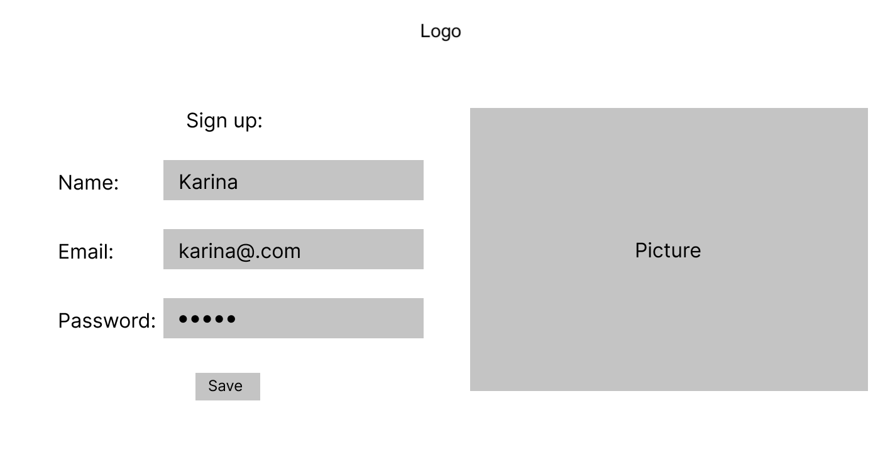
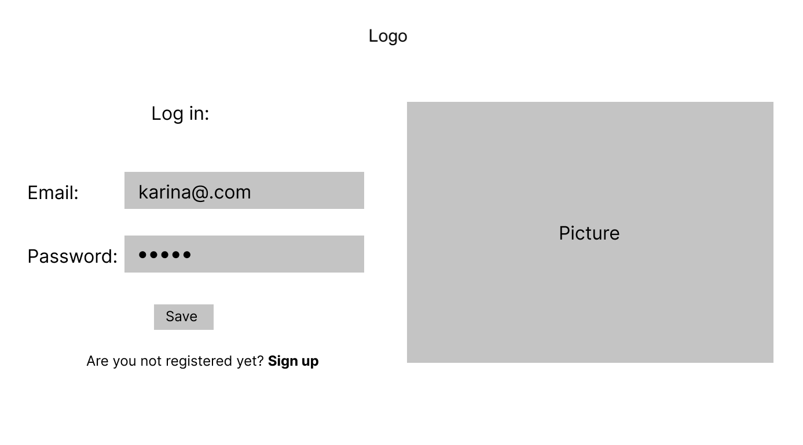
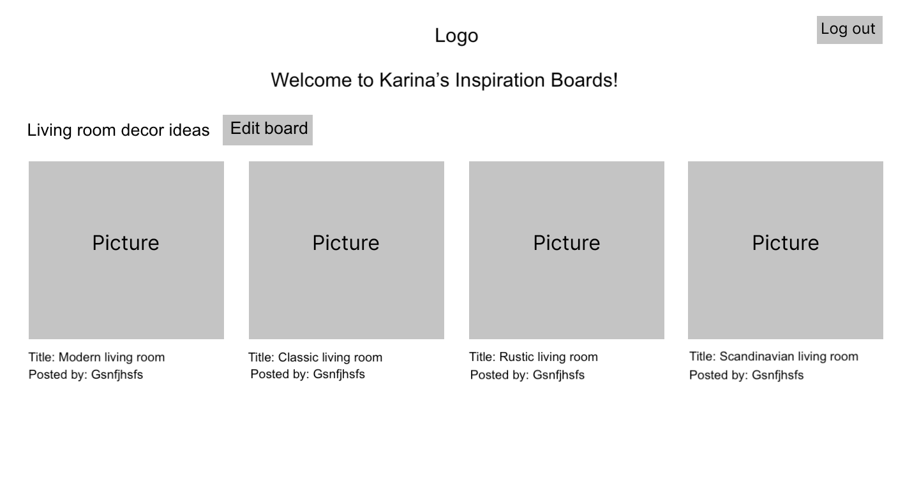

# Inspiration Board app

## Sumary

This is an application to search for images and inspirations to accomplish what you want.
The app has more than 300,000 pictures coming from all over the world and you can use them for your Inspiration Board.

<a href="https://nameless-mountain-77703.herokuapp.com/">Click here to check it out</a>

How to use it:

- Sign up and log in to create your Inspiration Board.
- Search for images by keywords of what you want to find.
- When you find images that interest you, click the button with a heart icon to add to your Inspiration Board.
- When the picture or the board is not more interesting for you, you can delete them.
- You can edit the title of the picture and the title of the board.

## Plan

# Diagram and Wireframes:

**Home Page:**

**Searching pictures**

**Signing up**

**Logging in**

**Welcome to your Inspiration Board**

# Steps:

# Database:

# Future Improvements

